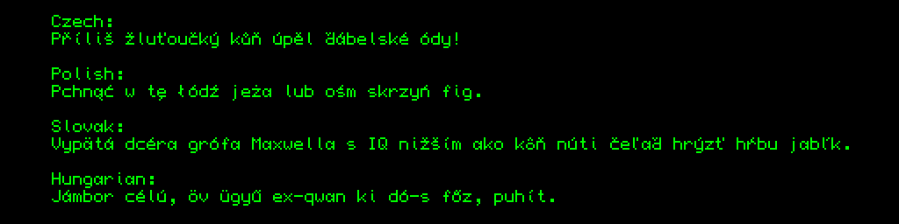

# ISO 8859-2 font for Sinclair QL

A SuperBasic code, which enables BASIC to print text in ISO-8859-2 and languages like Czech, Slovak, Polish, or Hungarian.

Toolkit II is required for the CHAR_USE command; on a plain QL, font change can be POKEd somehow, but apparently those POKE commands vary from ROM version to version, and everyone uses Toolkit II anyway. The font may not be a pretty one, but it works.
